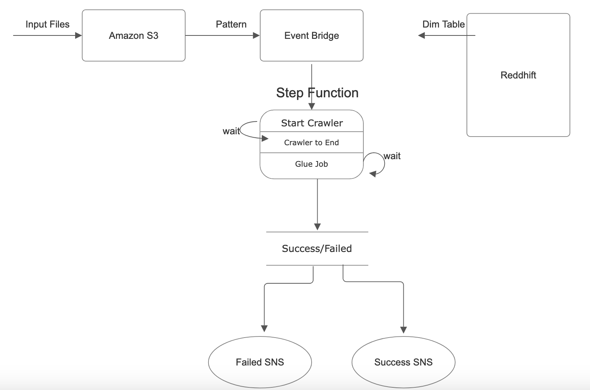

# Daily-Airline-Data-Ingestion

Daily incremental Load in Redshift Fact Table
As soon as the file lands in S3, we need to start the process.

A dimension table of Airport Codes (one-time) is loaded in the Redshift

## Tech Stack:

1. S3
2. S3 Cloudtrail Notification
3. Event Bridge Pattern Rule
4. Glue Crawler
5. Glue ETL Jobs
6. SNS for Notifications
7. Redshift Warehouse
8. Step Function for Orchestration

## Architecture

## Description:

A daily file is uploaded to S3, based on partition. Event bridge will capture the pattern and trigger the step function, which orchestrates the process. The Redshift will already have the Dimension  table.

When the data arrives in S3, a glue crawler is triggered. wait for the cralwer to complete the updataion the metadata and then trigger Glue Job. 

Glue Job will have Job bookmarking enabled to read new 

The status of Job will trigger a notification, a failed or a success Job. 

### Data Used:

For the Dimension Table, consisting of Aiport Codes:

[Airport Codes Data](Data/airports.csv)

Daily sample data that gets ingested to S3 and transformed.

[Daily Data Sample](Data/flights.csv)

### Script to run Glue Job and Transform:

[GlueJob](glue_job.py)
